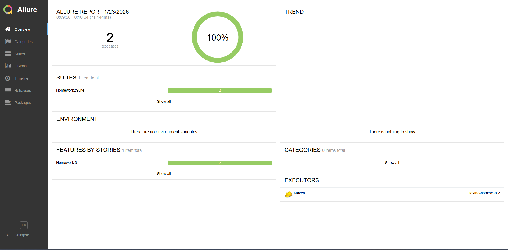

# Homework 2 — TestNG Practical Project
Tech: Java 17, Maven, Selenium 4, TestNG 7, Chrome + WebDriverManager

## Run
```bash
mvn clean test -Dheadless=true
```
Parallel classes via `src/test/resources/testng.xml`.

Notes: no `Thread.sleep()`, no absolute XPath, interactions+scrolling+selects covered.

# Homework 3 

## Allure Report
Generate results:
```bash
mvn clean test -Dheadless=true
```

Generate and open report:
```bash
mvn allure:report
mvn allure:serve
```

### Allure Report Screenshot

